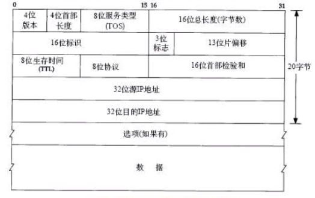

# 1 分层

- 链路层：ARP映射，以太网帧
- 网络层：IP协议，ICMP是IP协议的附属协议，IGMP协议
  - ping调用了ICMP
- 传输层：TCP协议、UDP协议
- 应用层：应用程序的端口号


# 2 封装与分用

- **发送端自顶向下进行封装**：

应用程序【发送的数据】→TCP【应用程序】→IP【TCP【应用程序】】→以太网数据帧【IP【TCP【应用程序】】】

- **接收端自底向上进行分用**


# 3 端口号

服务器提供的端口号是固定的，给客户端提供服务，一般低于1024，如http（80），https（443），ftp（20，21）

客户端的端口号是短暂随机的，一般为1024-5000


# 链路层：以太网帧和IEEE 802.3封装

相同点：

- 两种帧格式都采用48bit（6字节）的目的地址和源地址

## 以太网帧

数据报最小46个字节，低于46需要填充；最大1500字节，高于1500需要分片（分包）

1500是取传输路径上的**最小MTU**

```shell
目的MAC地址（6）|源MAC地址（6）|类型（2）|数据（46-1500）|CRC（4）

不同类型的以太网帧发送的数据类型如下：
类型0800（2）|IP数据报（46-1500）
类型0806（2）|ARP请求/应答（28）+PAD填充字段（18）
类型0835（2）|RPAP请求/应答（28）+PAD填充字段（18）
```


# 网络层：IP协议



总长度100字节=IP首部（20）+选项（40）+数据（40）

选项：记录传输过程中的路由记录