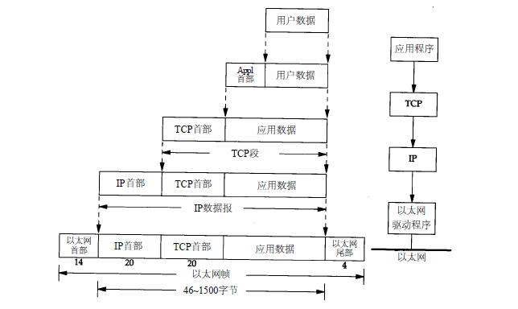
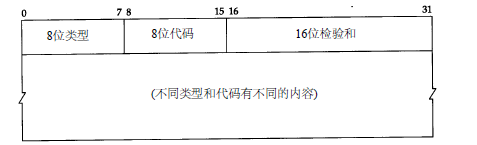

# 协议

规定了通信双方**数据传输的格式和方法**


# 1 TCP/IP协议分层

自顶向下：

- 应用层：应用程序的端口号
- ==传输层==：提供端到端的服务；TCP协议、UDP协议

- ==网络层==：提供点到点的服务；IP协议，ICMP协议，IGMP协议
  - ping调用了ICMP
- 链路层：ARP映射，以太网帧


# 2 封装与分用



- **发送端自顶向下进行封装**：

应用程序【发送的数据】→TCP【应用程序】→IP【TCP【应用程序】】→以太网数据帧【IP【TCP【应用程序】】】

- **接收端自底向上进行分用**


# 3 端口号

服务器提供的端口号是固定的，给客户端提供服务，一般低于1024，如http（80），https（443），ftp（20，21）

客户端的端口号是短暂随机的，一般为1024-5000


# ==4 链路层==：以太网帧和IEEE 802.3封装

相同点：

- 两种帧格式都采用48bit（6字节）的目的地址和源地址

## 以太网帧

**数据报最小46个字节，低于46需要填充；最大1500字节，高于1500需要分片（分包）**

1500是取传输路径上的**最小MTU**

```shell
目的MAC地址（6）|源MAC地址（6）|帧类型（2）|数据（46-1500）|CRC（4）

不同类型的以太网帧发送的数据类型如下：
类型0800（2）|IP数据报（46-1500）
类型0806（2）|ARP请求/应答（28）+PAD填充字段（18）
类型0835（2）|RPAP请求/应答（28）+PAD填充字段（18）
```


## ==ARP：找到下一跳地址==

广播（发送端请求下一跳地址）：向所有路由发送ARP广播，寻找下一跳路由的MAC地址

单播（接收端应答下一跳地址）：向发送ARP广播的主机回应自己的MAC地址


**ARP 数据报**


```
目的MAC（6）|源MAC（6）|帧类型（2）硬件类型（2）协议类型（2）|...|发送端MAC|发送端IP（4）|目的MAC|目的IP
```

作用：获取下一跳的MAC地址


数据包在网络传输的过程中会经过一个一个的路由节点，是如何找到到达目的地所需要经过的路由节点？

实际上，数据包不是只打包一次解包一次的

数据包想要达到下一个路由节点（下一跳）时，一开始是不知道这个路由器的MAC地址的

因此需要对**链路层和网络层进行解包**

网络层解包：获得了==当前IP地址==和最终要到达的==目的地IP地址==

当前路由器参照路由表，路由表中记录了到达目的地IP地址所经过的==下一跳路由器IP地址==

链路层解包：获得了==当前MAC地址==

于是再将==当前IP地址==、==当前MAC地址==和==下一跳的IP地址==打包起来，并向路由表中的所有路由器发送一个ARP广播请求

匹配的下一跳路由器接收到ARP请求，将自己的MAC地址进行补充，然后又按照自身的路由表发送一个ARP单播请求

此时发送端接收到这个ARP请求，获得了下一个路由节点的MAC地址后，就可以将这个MAC地址填充到以太网帧中，进行正常的网络传输

**简单来说，发送端到接收端中途会经过许多路由器，每要到达下一个路由器，都需要对数据包的链路层和网络层进行一次解包，从而获得下一个路由器的MAC地址，再将数据包发送给这个路由器，以此类推，最终到达接收端**


==注意！！！==

- ==以太网帧和ARP数据报中的源MAC和目的MAC是指当前的MAC和下一跳的MAC，它们负责找到传输路径==
- ==真正的目的地IP是封装在网络层的IP协议中的==


# ==5 网络层==：IP协议

IP提供不可靠、无连接、无序的数据报传送服务

不可靠是指：不能保证IP数据报能够成功到达目的地，中途可能会因为网络延时或阻塞造成数据报丢失


总长度100字节=IP首部（20）+选项（40）+数据（40）

- 前32位：网络字节序（big endian 字节序），IP数据报传输时必须统一网络字节序
- 16位标识：标识主机发送的每一份数据报
- 8位生存时间：数据报可以经过的最多路由器数量，通常为64或128，经过一个路由器TTL值减1；当TTL=0时，数据报丢弃，并发送ICMP报文通知源主机

- 选项：记录传输过程中的路由记录


## IP路由选择

IP路由选择是逐跳进行的，只为IP数据报提供下一跳路由器的IP地址

### 路由表

IP层在内存中有一个路由表，路由表包含以下信息：

- 目的IP地址
- 当前IP的下一跳路由器的IP地址，或者直连的网络IP地址
- 标志
- 为数据报的传输指定一个网络接口

### 路由选择步骤

- 搜索路由表，寻找能与目的IP地址完全匹配的路由表，如果找到，就把数据报发送给路由表中指定的下一跳路由器或直连的网络IP地址
- 搜索路由表，寻找能与目的网络号相匹配的路由表，后续步骤同上
- 搜索路由表，寻找标为“默认（default）”的路由表（默认是下一跳地址），后续步骤同上

如果上述都不能成功，数据报就不能被发送，返回“主机不可达”、“网络不可达”的错误


## ICMP协议

协议号：1

ICMP是IP的附属协议，是一种功能协议，是在IP数据报内部传输的，**封装在IP数据报内部**

主要功能：

- 确认IP包是否成功送达目标地址
- 通知在发送过程中IP包被废弃的具体原因
- 改善网络设置

**作用：**测试网络，确认网络是否正常工作，遇到异常时进行问题诊断



```
8位类型|8位代码|16位校验和
（不同类型和代码有不同的内容）
```

常见类型代码：

- 8 0：请求回显（ping请求），查询报文
- 0 0：回显应答（ping应答），查询报文
- 3 x：不可达，差错报文
- 5 x：重定向，差错报文
- 11 x：超时，差错报文


# 6 ==传输层==：UDP协议

UDP是不可靠传输协议

UDP封装

UDP首部

端口号：表示发送进程和接收进程

